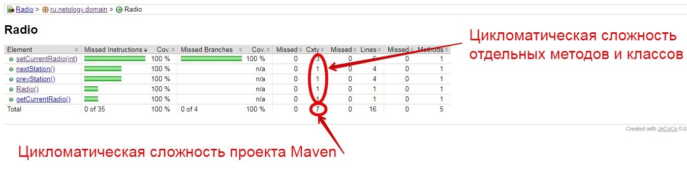
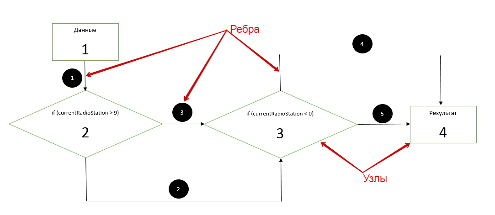

# Использование счетчика COMPLEXITY - подсчет сложности кода

## Краткое описание COMPLEXITY

Счетчик COMPLEXITY вычисляет цикломатическую сложность для каждого неабстрактного метода и суммирует сложность для классов, пакетов и групп. Служит индикатором количества примеров модульного тестирования, которые полностью охватывают определенную часть программного обеспечения. Иными словами, цикломатическая сложность вычисляется путем суммирования всех узлов таких как if, while, for и др.

Цикломатическая сложность программного кода вычисляется по ниже приведенной формуле:

V = E - N + 2P

где
- V - показатель цикломатической сложности,
- Е - количество рёбер,
- N - количество узлов,
- Р - количество компонент связности.

Цикломатическая сложность Maven проекта (рассматривается реализация только методов переключения радиоканалов "next" (public void nextStation) и "prev" (public void prevStation()), согласно сгененрированного отчета JaCoCo составляет 7, которая состоит из:
- цикломатической сложности метода setCurrentRadio(int) равной 3
- цикломатической сложности метода nextStation() равной 1
- цикломатической сложности метода prevStation() равной 1
- цикломатической сложности класса Radio() равной 1
- цикломатической сложности метода getCurrentRadio() равной 1



Цикломатическая сложность методов nextStation(), prevStation(), getCurrentRadio() и класса Radio() равна 1, так как данные структуры не содержат в своем коде узлов таких как if, while, for и др.

Так как setCurrentRadio(int) содержит в своем коде узел с условие if

```java
if (currentRadioStation > 9) {
            currentRadioStation = 0;
}
if (currentRadioStation < 0) {
            currentRadioStation = 9;
}
```        
То цикломатическая сложность данного метода будет рассчитана следующим образом:

- Е - количество рёбер = 5
- N - количество узлов = 4
- Р - количество компонент связности = 1 (для отдельной программы (или подпрограммы, или метода) P всегда равно 1.

V = E - N + 2P = 5 - 4 + 2 х 1 = 3



Высокая цикломатичсекая сложность кода - сложна и затруднительна для чтения и обеспечения. Порог цикломатической сложности может устанавливаться в отдельных организациях по разному. Стандартный порог цикломатичсекой сложности принято считать 10.